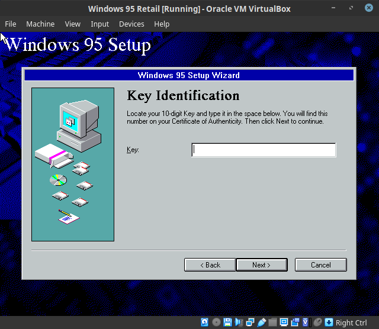
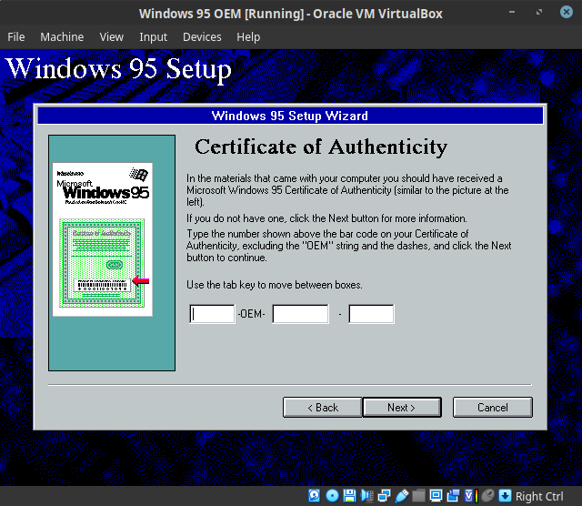

# [alex-free.github.io](https://alex-free.github.io)

# Open95Keygen

by Alex Free

Open95Keygen is a portable open source program that generates random valid Product Keys (both OEM and Retail types) for Microsoft's Windows 95 and Windows NT 4.0 operating systems.

The Windows 95/NT 4.0 OEM/Retail Product Key algorithms have been reverse engineered by many people. Open95Keygen is a **[clean room design](https://en.wikipedia.org/wiki/Clean_room_design)** implementation not based on any existing software, it is written based on the specifications of the algorithm which is **inherently not copyright infringement**. I was inspired to write Open95Keygen after watching the YouTuber [stack smashing's](https://www.youtube.com/channel/UC3S8vxwRfqLBdIhgRlDRVzw) video [Why 111-1111111 is a valid Windows 95 key](https://www.youtube.com/watch?v=cwyH59nACzQ).

## Table Of Contents

*   [Downloads](#downloads)
*   [Usage](#usage)
*   [Building From Source](#building-from-source)
*   [License](#license)

## Links

* [GitHub](https://github.com/alex-free/open95keygen)

* [HomePage](https://alex-free.github.io/open95keygen)

## Downloads

### Version 1.0.2 (2/16/2023)

[open95keygen-1.0.2-windows_x86](https://github.com/alex-free/open95keygen/releases/download/v1.0.2/open95keygen-1.0.2-windows_x86.zip) _For Windows 95 OSR 2.5 Or Newer (32-bit Windows)_

[open95keygen-1.0.2-windows\_x86\_64](https://github.com/alex-free/open95keygen/releases/download/v1.0.2/open95keygen-1.0.2-windows_x86_64.zip) _For 64 bit Windows_

[open95keygen-1.0.2-linux_x86](https://github.com/alex-free/open95keygen/releases/download/v1.0.2/open95keygen-1.0.2-linux_x86.zip) _For modern x86 Linux distros_

[open95keygen-1.0.2-linux\_x86\_64](https://github.com/alex-free/open95keygen/releases/download/v1.0.2/open95keygen-1.0.2-linux_x86_64.zip) _For modern x86_64 Linux distros_

[Source Code](https://github.com/alex-free/open95keygen/archive/v1.0.2.zip)

Changes:

*   Fixed a really old non-fatal bug (thanks [@JeanPaulLucien](https://github.com/JeanPaulLucien)!).
*   Cleaned up more code and added some comments.

### Version 1.0.1 (2/13/2023)

[open95keygen-1.0.1-windows_x86](https://github.com/alex-free/open95keygen/releases/download/v1.0.1/open95keygen-1.0.1-windows_x86.zip) _For Windows 95 OSR 2.5 Or Newer (32-bit Windows)_

[open95keygen-1.0.1-windows\_x86\_64](https://github.com/alex-free/open95keygen/releases/download/v1.0.1/open95keygen-1.0.1-windows_x86_64.zip) _For 64 bit Windows_

[open95keygen-1.0.1-linux_x86](https://github.com/alex-free/open95keygen/releases/download/v1.0.1/open95keygen-1.0.1-linux_x86.zip) _For modern x86 Linux distros_

[open95keygen-1.0.1-linux\_x86\_64](https://github.com/alex-free/open95keygen/releases/download/v1.0.1/open95keygen-1.0.1-linux_x86_64.zip) _For modern x86_64 Linux distros_

[Source Code](https://github.com/alex-free/open95keygen/archive/v1.0.1.zip)

Changes:

* Rewrote documentation in markdown.
* Rewrote makefile.
* Slight optimizations and better code clarity (it's been 2 years!).

View [all releases](https://github.com/alex-free/open95keygen/releases/).

## Usage

This is a command line program, so on Windows you first must open the `command.com` or `cmd.exe` program. Then just drag o95kg.exe into the `command.com` or `cmd.exe` window and press the `enter` or `return` key.

On Linux, you may be able to just double click the `o95kg` file to start Open95Keygen. If this does not work, start your terminal program and execute `./o95kg` from inside the release directory.

### OEM or Retail?

On Windows 95/NT 4.0, if you see the word OEM in between where you enter the Product Key, use the generated OEM Product Key. If you do not see the word OEM when asked to enter a Product Key, use the generated Retail Product Key:

## Building From Source

Just [download](#downloads) the source, cd into the source directory, and execute `make`.

## License

Open95Keygen is released under the 3-BSD license, see the file `license.txt` in each release for full info.